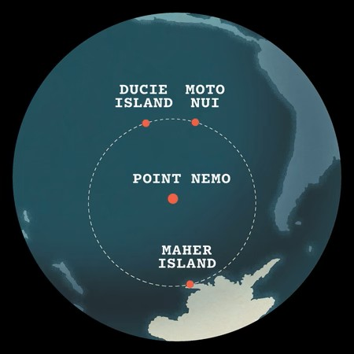

# About Me

Hello, my name is Alden and I live at Point Nemo (like Captain Nemo from *Twenty Thousand Leagues Under the Sea*) in the Pacific Ocean. 

## Point Nemo

You may be wondering: What is Point Nemo? It is the location in the ocean that is farthest from any land, known as a "Pole of Isolation." It is about **2,688 kilometers** or **1,450 nautical miles** from the nearest land: Durcie Island to the north and Maher Island (part of Antarctica) to the south. 

You can read more about it [here](https://www.ceros.com/inspire/originals/point-nemo/)
